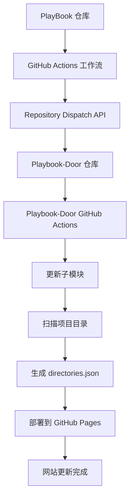

# 设计文档

## 概述

本系统实现了 PlayBook 仓库（子仓库）更新时自动触发 Playbook-Door 仓库（父仓库）工作流的功能。通过 GitHub Actions 和 Repository Dispatch API，当 PlayBook 仓库有新项目添加或现有项目修改时，Playbook-Door 网站会自动更新并重新部署。

## 架构

### 系统架构图



### 组件交互流程

1. **触发阶段**: PlayBook 仓库接收到 push 事件
2. **通知阶段**: PlayBook 工作流发送 API 请求到 Playbook-Door
3. **响应阶段**: Playbook-Door 工作流被触发
4. **同步阶段**: 更新子模块并扫描项目
5. **部署阶段**: 生成新的目录文件并部署网站

## 组件和接口

### PlayBook 仓库组件

#### GitHub Actions 工作流 (notify-parent.yml)
- **触发条件**: push 到 main 分支，或手动触发
- **主要功能**: 
  - 发送 Repository Dispatch 事件
  - 包含提交信息和元数据
  - 记录通知结果

#### 接口规范
```yaml
# 工作流触发器
on:
  push:
    branches: [ main ]
    paths:
      - '**/__meta__.txt'  # 只监控项目元数据文件
      - '*/'               # 监控新目录创建
  workflow_dispatch:       # 支持手动触发
```

#### API 调用接口
```bash
# GitHub Repository Dispatch API
POST https://api.github.com/repos/Space-tang/Playbook-Door/dispatches
Headers:
  - Accept: application/vnd.github.v3+json
  - Authorization: token ${PARENT_REPO_TOKEN}
  - X-GitHub-Api-Version: 2022-11-28
Body:
  - event_type: "submodule-update"
  - client_payload: {
      repository: "PlayBook",
      ref: "main",
      commit_message: "最新提交消息",
      commit_sha: "提交SHA",
      updated_at: "ISO时间戳"
    }
```

### Playbook-Door 仓库组件

#### GitHub Actions 工作流
- **触发条件**: repository_dispatch 事件，event_type 为 "submodule-update"
- **主要功能**:
  - 更新 PlayBook 子模块
  - 扫描项目目录结构
  - 生成 directories.json 文件
  - 部署到 GitHub Pages

#### 子模块更新接口
```bash
# 子模块更新命令
git submodule update --remote --merge
git add .
git commit -m "自动更新子模块: ${commit_message}"
```

#### 项目扫描接口
- **输入**: PlayBook 子模块目录
- **处理**: 递归扫描所有包含 __meta__.txt 的目录
- **输出**: directories.json 文件

### 认证组件

#### Personal Access Token
- **存储位置**: PlayBook 仓库的 PARENT_REPO_TOKEN 密钥
- **权限要求**:
  - `repo`: 完整的私有仓库控制权限
  - `workflow`: 更新 GitHub Actions 工作流权限

## 数据模型

### Repository Dispatch 事件负载
```json
{
  "event_type": "submodule-update",
  "client_payload": {
    "repository": "PlayBook",
    "ref": "main",
    "commit_message": "添加新项目: Awesome API",
    "commit_sha": "abc123def456",
    "updated_at": "2024-01-15T10:30:00Z"
  }
}
```

### 项目元数据模型 (__meta__.txt)
```ini
title = '项目标题'
description = '项目描述'
class = "项目分类"
tag = ["标签1", "标签2", "标签3"]
draft = false
```

### 目录结构输出模型 (directories.json)
```json
{
  "projects": [
    {
      "name": "project-name",
      "path": "project-name/",
      "title": "项目标题",
      "description": "项目描述",
      "class": "项目分类",
      "tags": ["标签1", "标签2"],
      "draft": false,
      "updated_at": "2024-01-15T10:30:00Z"
    }
  ],
  "generated_at": "2024-01-15T10:35:00Z",
  "total_projects": 1
}
```

## 错误处理

### PlayBook 仓库错误处理

#### API 请求失败
- **检测**: HTTP 状态码非 2xx
- **处理**: 记录详细错误信息，包括状态码和响应内容
- **恢复**: 支持手动重新触发工作流

#### 认证失败
- **检测**: 401 Unauthorized 或 403 Forbidden
- **处理**: 提供清晰的权限错误信息
- **解决**: 检查 PARENT_REPO_TOKEN 密钥和权限设置

### Playbook-Door 仓库错误处理

#### 子模块更新失败
- **检测**: git submodule 命令返回非零退出码
- **处理**: 记录 git 错误输出
- **恢复**: 尝试重置子模块状态后重新更新

#### 项目扫描失败
- **检测**: __meta__.txt 文件格式错误或缺失
- **处理**: 跳过有问题的项目，记录警告信息
- **恢复**: 继续处理其他有效项目

#### 部署失败
- **检测**: GitHub Pages 部署错误
- **处理**: 记录部署日志和错误信息
- **恢复**: 支持手动重新部署

## 测试策略

### 单元测试

#### PlayBook 工作流测试
- **测试场景**:
  - API 请求格式正确性
  - 错误处理逻辑
  - 提交信息提取

#### Playbook-Door 工作流测试
- **测试场景**:
  - 子模块更新逻辑
  - 项目扫描准确性
  - JSON 生成格式

### 集成测试

#### 端到端流程测试
- **测试步骤**:
  1. 在 PlayBook 创建测试项目
  2. 提交到 main 分支
  3. 验证 PlayBook 工作流执行
  4. 验证 Playbook-Door 工作流触发
  5. 验证网站更新结果

#### 错误场景测试
- **测试场景**:
  - 无效的 Personal Access Token
  - 网络连接失败
  - 格式错误的 __meta__.txt 文件
  - 子模块冲突

### 性能测试

#### 响应时间测试
- **指标**: 从 PlayBook 提交到网站更新的总时间
- **目标**: 5 分钟内完成整个流程

#### 并发测试
- **场景**: 多个开发者同时提交到 PlayBook
- **验证**: 工作流队列正确处理并发请求

## 监控和日志

### 日志记录策略

#### PlayBook 仓库日志
```bash
echo "✅ 已通知父仓库更新"
echo "🔄 Playbook-Door 将自动部署最新内容"
echo "📝 提交信息: ${COMMIT_MESSAGE}"
echo "🔗 提交SHA: ${COMMIT_SHA}"
```

#### Playbook-Door 仓库日志
```bash
echo "📥 收到子仓库更新通知"
echo "🔄 正在更新子模块..."
echo "📂 正在扫描项目目录..."
echo "📄 生成 directories.json 完成"
echo "🚀 开始部署到 GitHub Pages..."
echo "✅ 部署完成"
```

### 监控指标
- **成功率**: 工作流执行成功的百分比
- **响应时间**: 从触发到完成的时间
- **错误频率**: 各类错误的发生频率
- **API 调用状态**: GitHub API 请求的成功率

### 告警机制
- **工作流失败**: 发送邮件通知到仓库管理员
- **API 限制**: 监控 GitHub API 使用配额
- **部署失败**: 记录详细错误信息供排查